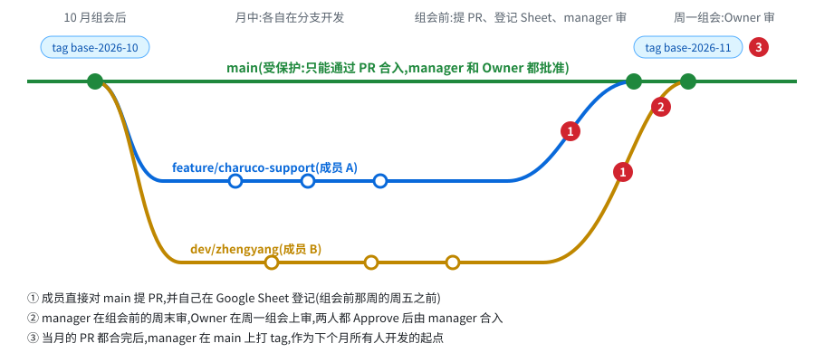
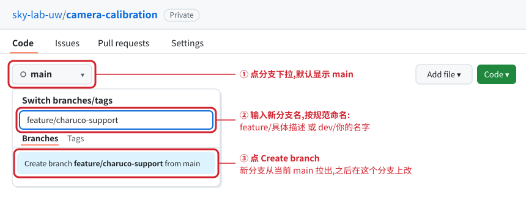
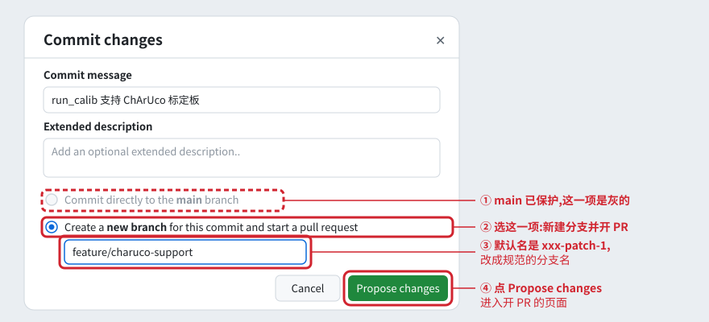
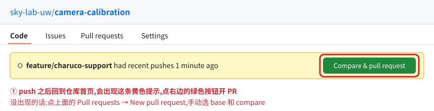
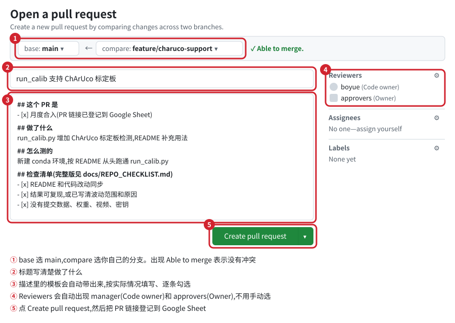
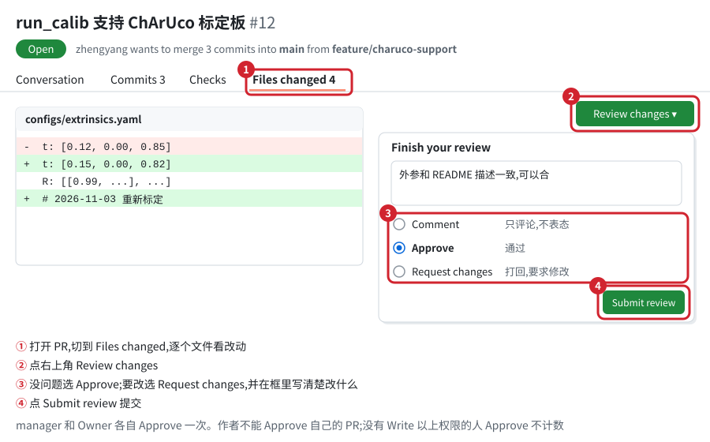
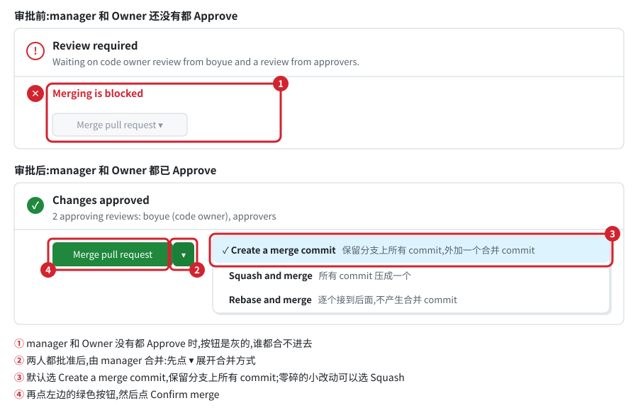

# 代码合入流程(成员手册)

**main 每个月合入一次。** 平时大家在自己的分支上开发;每月组会前,要合的人自己对 main 提 PR、自己登记到 Google Sheet;manager 在组会前的周末先审,周一组会上 Owner 再审;**两个人都 Approve 才能合进 main**。

仓库里该放什么、README 怎么写,见 [REPO_GUIDELINES.md](REPO_GUIDELINES.md);提 PR 前的逐项自查,见 [REPO_CHECKLIST.md](REPO_CHECKLIST.md)。

> 文中的图是示意图。按钮文字和位置跟 GitHub 页面一致,其他细节做了简化。

## 一、谁负责什么

| 角色 | 是谁 | GitHub 上的权限 | 做什么 |
|---|---|---|---|
| Owner | 导师 / 总负责人 | 组织 Owner,并且在 `approvers` Team 里 | 组会上审批每一个合进 main 的 PR |
| Manager | 每个仓库一个人,一般是建这个仓库的人。写在 README 顶部的"维护人"和仓库的 CODEOWNERS 里 | 建库的人自动是该仓库的 Admin | 建仓库、加成员;组会前审本仓库的每个 PR;组会后合并、打 tag |
| Member | 被 manager 加进仓库的同学 | 该仓库 Write(单独添加) | 在自己的分支开发,对 main 提 PR,自己登记 Sheet |

- 一个人可以是 A 仓库的 manager,同时是 B 仓库的 member。
- **每个仓库最好再定一个副 manager**,也写进 CODEOWNERS。作者不能批准自己的 PR,manager 自己提的 PR 要由副 manager 来审;没有副 manager,manager 自己的 PR 就合不了。

## 二、分支怎么分



| 分支 / tag | 谁建 | 用途 | 规则 |
|---|---|---|---|
| `main` | 建仓库时自动有 | manager 和 Owner 都审过的稳定版本 | 受保护:不能直接 push,只能通过 PR 合入,manager 和 Owner 都要批准 |
| `base-YYYY-MM`(tag) | manager | 当月的 PR 都合完后在 main 上打的标记,是下个月所有人开发的起点 | 打了就不再改 |
| `feature/具体描述`、`dev/你的名字` | 成员自己 | 日常开发。一个 PR 对应一个分支 | 自己随便推 |
| `hotfix/具体描述` | manager | 紧急修复,见第九节 | 同样要 manager 和 Owner 批准 |

## 三、每个月的时间线

| 时间 | 谁 | 做什么 |
|---|---|---|
| 月中 | member | 在自己的分支上开发 |
| **组会前那一周的周五之前** | member | 对 main 提 PR,登记到 Google Sheet。之后提的进下个月 |
| 组会前的周末 | manager | 逐个审本仓库的 PR,Approve 或者打回;本仓库这个月没有 PR 的,在 Sheet 里填一行写原因 |
| 周一组会 | Owner | 按 Sheet 的顺序逐个审 |
| 组会后 | manager | 按顺序合并,打 base tag,通知大家同步 |

## 四、第一次:建仓库(Owner 或 manager 做,每个仓库只做一次)

1. **新建仓库。** GitHub 右上角 **+ → New repository**:
   - Owner 选 `sky-lab-uw`,名字按 `方向-内容` 命名
   - 选 **Private**
   - 勾 **Add README**,这样 main 一开始就存在,后面才能对它开 PR
   - License 按 REPO_GUIDELINES 选,一般选 MIT;基于 Apache-2.0 项目改的选 Apache-2.0

   分支保护不用自己设。组织规则对所有仓库自动生效,建好后在 **Settings → Rules → Rulesets** 能看到从组织继承下来的规则。
2. **加成员。** 仓库 **Settings → Collaborators and teams → Add people**,输入用户名:
   - 成员给 **Write**
   - 副 manager 给 **Maintain**
   - Owner 不用加,组织 Owner 对所有仓库自动有权限
3. **整理代码,加上 CODEOWNERS,推到初始化分支。** 先对照 [REPO_CHECKLIST.md](REPO_CHECKLIST.md) 把"每个仓库"那几项过一遍。然后:
   ```bash
   git clone git@github.com:sky-lab-uw/camera-calibration.git
   cd camera-calibration
   git checkout -b init/2026-10
   # 把整理好的代码拷进来,再新建 .github/CODEOWNERS,内容一行:
   #   *    @你的用户名 @副manager用户名
   git status                       # 先看一眼要提交哪些文件
   git add README.md requirements.txt configs/ scripts/ src/ .gitignore LICENSE .github/CODEOWNERS
   git commit -m "init: camera-calibration 2026-10 base"
   git push -u origin init/2026-10
   ```
4. **开 PR:`init/2026-10` → `main`**(怎么开见第五节第 4 步),登记到 Sheet。这个 PR 合入之前仓库里还没有 CODEOWNERS,所以只需要 Owner 批准。Owner 审的时候顺便确认 CODEOWNERS 里写的人对不对。
5. **合入后打第一个 base tag:**
   ```bash
   git checkout main
   git pull
   git tag -a base-2026-10 -m "camera-calibration 2026-10 组会后的 base"
   git push origin base-2026-10
   ```

## 五、成员:开发和提 PR

### 1. 从最新的 main 拉自己的分支

命令行:
```bash
git fetch origin
git checkout -b feature/charuco-support origin/main
```

网页:



### 2. 改代码、提交、推到自己的分支

```bash
git status
git add scripts/run_calib.py README.md        # 只加你改过的文件,别用 git add .
git commit -m "run_calib 支持 ChArUco 标定板"
git push -u origin feature/charuco-support    # 第一次推加 -u,之后直接 git push
```

在网页上直接改文件的话,点 **Commit changes** 后会弹出这个框:



- 在 **main** 上点的编辑:第一项是灰的,选第二项新建分支。
- 已经切到**自己的分支**再编辑:第一项会变成 "Commit directly to the feature/xxx branch",直接选它。

### 3. 提 PR 之前:先把最新的 main 合进来

别人上个月的改动可能和你的冲突,提 PR 前先在自己这边解决:
```bash
git fetch origin
git merge origin/main          # 有冲突就按提示改完,再 git add、git commit
git push
```

### 4. 对 main 提 PR

截止时间是**组会前那一周的周五**。push 完回到仓库首页,点黄色提示条上的按钮:



进入开 PR 的页面,**base 选 main**。Reviewers 会根据规则自动出现 manager 和 approvers,不用手动选:



装了 GitHub CLI(`gh`)的话,命令行也可以:
```bash
gh pr create --base main --title "run_calib 支持 ChArUco 标定板"
```

### 5. 登记到 Google Sheet

PR 开好后,在本月的 Sheet 里**自己加一行**,填前几栏:月份、仓库、提交人、做了什么、PR 链接、自查表是否完成。审核结果和 tag 由 manager 和 Owner 填。表头见 [templates/monthly_review_sheet.csv](../templates/monthly_review_sheet.csv)。

**没登记的 PR,组会上不审。**

### 6. 被打回了

在**同一个分支**上接着改、接着 push,PR 会自动更新,不用关掉重开。改完在 PR 里回复一句,再点右侧 Reviewers 里审核人名字旁边的刷新图标,重新请求 review。

注意:**批准之后再推新的 commit,之前的批准会作废**,要重新审。所以尽量在组会前改完,Owner 批准后就不要再动这个分支了。

### 7. 没赶上,或者这个月不打算合

PR 可以先开着,在 Sheet 里写"下月再合"。下个月接着用同一个 PR。

### 8. 合入之后

已经合进 main 的分支可以删掉,下一个功能从新的 main 重新拉。还在开发的分支,把新的 main 合进来(同第 3 步)。

## 六、Manager:组会前审核

组会前的周末,按 Sheet 里本仓库的行逐个打开 PR 审:



审的时候主要看:
- 对照 [REPO_CHECKLIST.md](REPO_CHECKLIST.md),尤其是 README 和代码是否一致、有没有提交大文件和密钥、结果能不能复现
- PR 页面有没有显示冲突(This branch has conflicts)。有的话让作者在组会前处理

审完在 Sheet 的"Manager 审核"一栏填:通过 / 打回。

本仓库这个月没人提 PR 的,manager 在 Sheet 里填一行,写"本月无合入"和原因或进度。每个仓库每个月都有记录,才看得出哪个仓库落灰了。

## 七、组会上:Owner 审核

按 Sheet 的顺序逐个打开 PR,操作跟上面那张图一样:
- 没问题:**Approve**
- 要改:**Request changes**,写清楚改什么。作者改完后 manager 和 Owner 重新审,Owner 可以会后在线上批,不用等下个月

审完在 Sheet 的"Owner 审核"一栏填:通过 / 打回 / 下月再合。

## 八、合并和收尾(manager)

manager 和 Owner 都 Approve 之后,**由 manager 按 Sheet 的顺序逐个合并**。合并方式默认选 **Create a merge commit**,保留分支上所有的 commit:



前面的 PR 合进去以后,后面的 PR 可能出现冲突。这时让作者把最新的 main 合进自己的分支、解决冲突后 push。因为推了新 commit,之前的批准会作废,需要 manager 和 Owner 再批一次。

当月的 PR 都合完后:
1. 打 tag:
   ```bash
   git checkout main
   git pull
   git tag -a base-2026-11 -m "camera-calibration 2026-11 组会后的 base"
   git push origin base-2026-11
   ```
2. 在 Sheet 里补上 tag 名。
3. 群里通知:"camera-calibration 11 月已合入,还在开发的分支 `git fetch` 后把 origin/main 合进去"。
4. 合并后 PR 页面上有 **Delete branch** 按钮,已合并的分支可以删掉。tag 还在,随时能回到当时的版本。

## 九、紧急修复

README 写错导致别人跑不起来、明显的 bug,这类等不了一个月的:manager 从 main 拉 `hotfix/具体描述`,改完直接对 main 开 PR,找副 manager 和 Owner 线上审批,在 Sheet 里加一行备注"紧急修复"。

## 十、常见问题

| 现象 | 原因 / 怎么办 |
|---|---|
| `git push origin main` 报 `GH013: Repository rule violations` | 正常,main 不允许直接推。推到自己的分支再开 PR |
| PR 一直显示 Review required,Merge 按钮是灰的 | manager 和 Owner 还没有都 Approve |
| 有人 Approve 了还是不能合 | 只有 manager 或只有 Owner 批了;或者点 Approve 的人既不在 CODEOWNERS 里,也不在 `approvers` 里,不计数 |
| manager 自己提的 PR 怎么也合不了 | 作者不能批准自己的 PR,CODEOWNERS 里需要再写一个副 manager 来批 |
| Approve 之后又推了新 commit,批准没了 | 规则设置了"有新推送,旧批准作废",需要重新审 |
| 没看到黄色的 Compare & pull request 提示 | 点 **Pull requests → New pull request**,手动选 base 和 compare |
| PR 提示有冲突(This branch has conflicts) | 在自己分支上 `git merge origin/main`,本地解决冲突后 push |
| 推自己的分支报 403 | 你没有被加进这个仓库,或者只有 Read。找这个仓库的 manager |

## 十一、管理员一次性设置(Owner 看)

成员不用看这一节。这些设置做一次,以后不管谁新建仓库都自动生效。

**1. 建 `approvers` Team,只放 Owner**

`https://github.com/orgs/sky-lab-uw/teams` → **New team**,名字 `approvers`,把 Owner 加进去。

为什么要建:规则里"必须某个人批准"有两种写法——CODEOWNERS 里可以直接写个人,规则里的 Required reviewers 只能选 Team。manager 写在 CODEOWNERS 里,Owner 就只能通过 Team 来指定。不能把 Owner 也写进 CODEOWNERS 里代替,因为 CODEOWNERS 一行写多个人的意思是"任意一人批准即可",那样 Owner 一个人批就够了,manager 就不是必须的了。

除了这个 Team,其他人照旧在各个仓库单独添加,不用按方向建 Team。

**2. 成员权限**(组织 **Settings → Member privileges**)
- Base permissions:**Read**(大家能互相看代码)或 **No permission**(只能看到被加进去的仓库)
- Repository creation:只勾 **Private**,manager 才能自己建仓库。这个开关是对全体成员的,没法只开给 manager,但下面的规则对任何人建的仓库都生效,所以没关系
- Repository deletion and transfer:**不勾**。建库的人是仓库 Admin,不勾的话他能删库
- Repository visibility change:**不勾**。转 public 只能由 Owner 操作
- 允许仓库管理员邀请外部协作者:**不勾**

**3. 组织级规则**(`https://github.com/organizations/sky-lab-uw/settings/rules` → **New branch ruleset**)
- Enforcement status:**Active**
- Bypass list:**留空**。尤其不要加 "Repository admin",否则建库的 manager 就能绕过规则
- Target repositories:**All repositories**,新建的仓库自动生效
- Target branches:**Include default branch**
- 勾 **Restrict deletions**、**Block force pushes**
- 勾 **Require a pull request before merging**,展开后:
  - Required approvals:**1**
  - 勾 **Require review from Code Owners**:CODEOWNERS 里的 manager 必须批
  - **Required reviewers**:Team 选 `approvers`,文件匹配 `*`,至少 1 人:Owner 必须批
  - 勾 **Dismiss stale pull request approvals when new commits are pushed**
  - 勾 **Require approval of the most recent reviewable push**
  - Allowed merge methods:**Merge** 和 **Squash** 都勾上

Required approvals 填 1 就够了。后面两条已经保证 manager 和 Owner 两个不同的人都批过;填 2 的话,新仓库第一个 PR(还没有 CODEOWNERS 的时候)只有 Owner 能批,会卡住。

**4. 注意**
- 组织级规则和 private 仓库的分支保护需要 GitHub Team 计划。学校组织可以通过 GitHub Education 免费升级;免费组织只能对 public 仓库逐个设置。
- 界面上找不到 Required reviewers 的话:CODEOWNERS 改写成 `* @sky-lab-uw/approvers`,强制 Owner 批;Required approvals 设 2,保证还有第二个人批。但第二个人是不是 manager,只能靠流程约定。
- 以后仓库和人多了,可以按方向建 Team(`camera`、`vla`……),给仓库授权时加 Team,不用一个个加人。
- 仓库转 public 之前,把 REPO_CHECKLIST 里"开源前"那几项全部过一遍。
