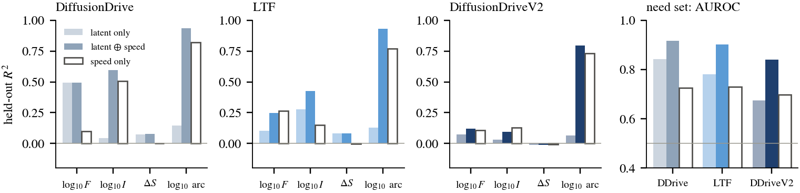
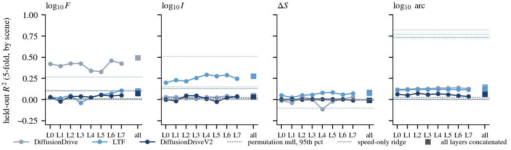
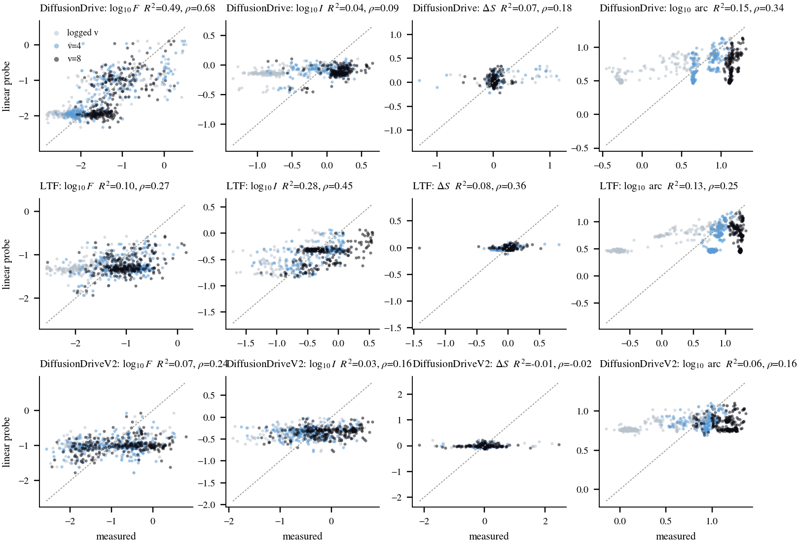
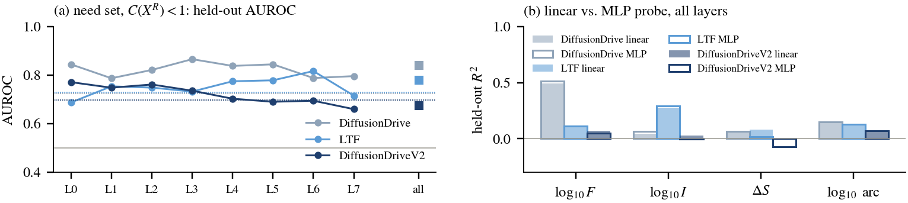
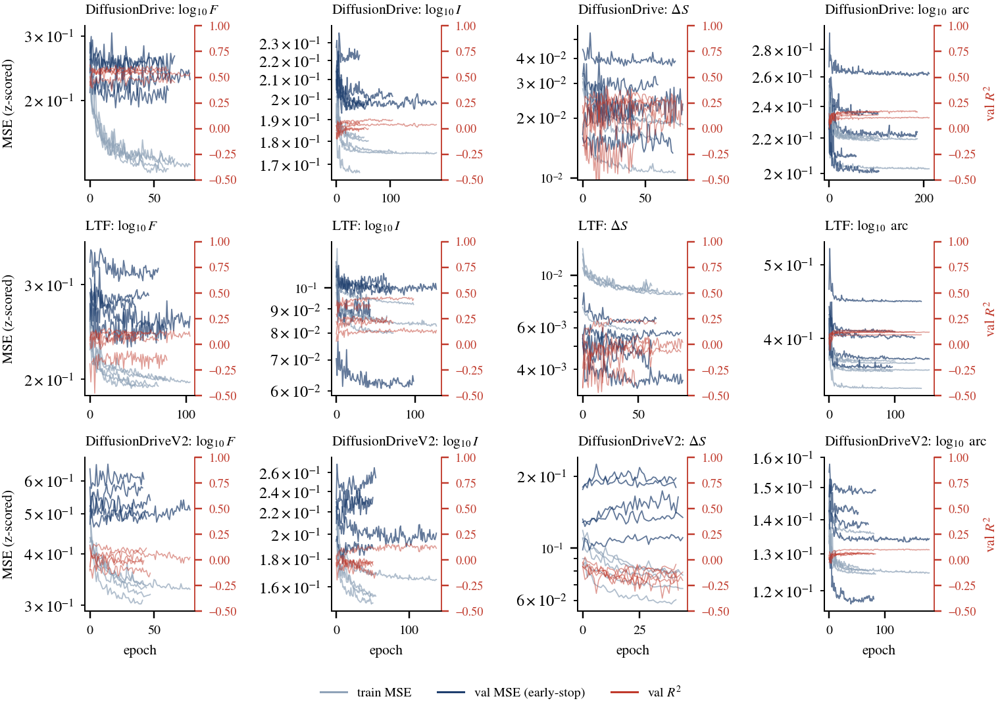

# Probe v0: Are the Counterfactual Readouts Linearly Decodable from a Policy's Perception Latent?

*Step 1 of the "evaluation agent" line. Three BEV planners, 246 NAVSIM Singapore near-pedestrian scenes, three input speeds. Everything below is reproducible from `scripts/` on the local 5090.*

## Abstract

The check-up reads a policy through counterfactual pairs: how far its plan moves when the pedestrian is removed ($F$), when the scene is re-lit ($I$), and whether the movement buys clearance ($\Delta S$). An evaluation agent that speaks for a policy from its internals would have to recover these readouts from the latent of a *single* query, without running the counterfactuals. We test the simplest version of that claim: a linear probe from the mean-pooled self-attention activations of DiffusionDrive, LTF and DiffusionDriveV2 on the original image to the readouts measured with the edits. Held-out by scene, the magnitudes $\log F$ and $\log I$ are linearly decodable for DiffusionDrive and LTF ($R^2 = 0.57$–$0.60$ at the logged speed) and the need set ($C(X^R)<1$) is separable (AUROC $0.90$–$0.92$ once speed is supplied), but the *direction* of the response, $\Delta S$, is not decodable from any layer of any policy ($R^2 \le 0.08$), and DiffusionDriveV2's backbone latent carries little of either ($R^2 \le 0.20$). A two-layer MLP does not improve on the linear probe. Two consequences for the agent: the backbone latent must be paired with the ego-status input, because the hooked layers are speed-invariant by construction; and whatever language the agent produces about *whether a move helped* cannot be grounded in these latents, only what it says about *how much* the plan would move.

## 1. Setup

**Scenes and units.** The 246 NAVSIM test-split Singapore scenes with a pedestrian near the ego corridor and a complete logged pedestrian future, i.e. the same pool as Sec. IV-B of the paper. Each scene is queried at three input speeds, the logged one and 4 and 8 m/s, giving 738 units per policy. Speeds are injected through the official status vector exactly as in `axes_cf_bev.py`.

**Latents.** For each policy we hook the eight `SelfAttention` blocks of the TransFuser backbone (the same hooks used for the steering experiments) and mean-pool the 320 tokens of each block (256 image tokens, 64 BEV/LiDAR tokens) into one vector per layer. Channel widths are 64, 64, 128, 128, 256, 256, 512, 512; the concatenation of all eight is 1,920-d. Only the query on the original image $O$ is used as input. The extraction reproduces the paper's stored trajectories to machine precision (max deviation 0 for every condition and speed, `results/extract_*.log`), so the labels below are the paper's numbers.

**Targets.** From the same process' clean / removed / re-lit trajectories:
$\log_{10} F$, $\log_{10} I$ (log because both are heavy-tailed), $\Delta S = S(X^O) - S(X^R)$ in metres, $\log_{10}$ arc length of $X^O$ as a sanity target that the plan itself must encode, and the binary need indicator $C(X^R) < 1$ m. Need cells per policy: DiffusionDrive 66, LTF 69, DiffusionDriveV2 152.

**Probes and loss.**
- Linear: ridge regression, $\min_w \|y - Xw\|^2 + \alpha\|w\|^2$ on standardised features, $\alpha$ chosen by inner leave-one-out CV over $10^{-2}$–$10^{4}$; logistic regression with balanced class weights for the need indicator.
- Non-linear control: MLP 1920→256→64→1 (GELU, dropout 0.3), MSE on the z-scored target, AdamW ($10^{-3}$, weight decay $10^{-2}$), batch 64, up to 300 epochs, early stopping on a scene-held-out validation split with patience 40. Train/val MSE and validation $R^2$ / Spearman are logged per epoch to TensorBoard (`tb/{policy}/{target}/fold{k}`, 60 runs).
- Evaluation: 5-fold `GroupKFold` by scene, so the three speeds of a scene never straddle a fold; held-out $R^2$ and Spearman $\rho$ on the concatenated out-of-fold predictions; AUROC for need.
- Controls: a ridge on speed alone ($v$, $v^2$), and a permutation null (labels shuffled by scene block, 20 draws, 95th percentile of $R^2$).

## 2. Results

### 2.1 The backbone latent is speed-invariant

For every policy the pooled activations of a scene are bit-identical at the logged speed, 4 m/s and 8 m/s (max $|x_{\text{logged}} - x_{8}| = 0$ at every layer), whereas the re-lit query moves them by 4.7–10.3 units in the last layer. The status vector enters the TransFuser after the backbone, so the hooked layers see the image and the LiDAR only. Any readout that depends on the injected speed, which includes $F$, need and arc length in the counterfactual-speed cells, is therefore *not* recoverable from the latent alone, and the fair input for an evaluation agent is latent $\oplus$ speed. Fig. 1 reports latent-only, latent $\oplus$ speed and speed-only side by side.



*Fig. 1. Held-out $R^2$ of the linear probe with three inputs. Speed alone explains arc length ($R^2$ 0.73–0.82) and, for DiffusionDrive, $\log I$; the latent adds what speed cannot: $\log F$ for DiffusionDrive, $\log I$ for LTF, and the need set for all three.*

### 2.2 What is decodable

Table 1 gives the concatenated-layer linear probe with and without speed, and the scene-level probe at the logged speed only (246 units, one latent per scene).

| Policy | input | $\log F$ $R^2$ ($\rho$) | $\log I$ $R^2$ ($\rho$) | $\Delta S$ $R^2$ ($\rho$) | $\log$ arc $R^2$ | need AUROC |
|---|---|---|---|---|---|---|
| DiffusionDrive | latent | 0.49 (0.68) | 0.04 (0.09) | 0.07 (0.18) | 0.15 | 0.84 |
| | latent ⊕ speed | 0.49 (0.78) | 0.59 (0.62) | 0.08 (0.14) | 0.94 | 0.92 |
| | speed only | 0.10 | 0.51 | 0.00 | 0.82 | 0.73 |
| | latent, logged speed only | 0.60 (0.73) | 0.60 (0.67) | 0.03 (0.39) | 0.90 | – |
| LTF | latent | 0.10 (0.27) | 0.28 (0.45) | 0.08 (0.36) | 0.13 | 0.78 |
| | latent ⊕ speed | 0.25 (0.55) | 0.43 (0.63) | 0.08 (0.36) | 0.93 | 0.90 |
| | speed only | 0.27 | 0.15 | 0.00 | 0.77 | 0.73 |
| | latent, logged speed only | 0.57 (0.71) | 0.57 (0.65) | 0.14 (0.18) | 0.96 | – |
| DiffusionDriveV2 | latent | 0.07 (0.24) | 0.03 (0.16) | −0.01 (−0.02) | 0.06 | 0.68 |
| | latent ⊕ speed | 0.12 (0.39) | 0.09 (0.34) | −0.01 (−0.02) | 0.79 | 0.84 |
| | speed only | 0.11 | 0.13 | −0.01 | 0.73 | 0.70 |
| | latent, logged speed only | 0.20 (0.37) | 0.07 (0.25) | 0.00 (−0.08) | 0.76 | – |

*Table 1. Held-out linear probes, 5-fold by scene. Permutation-null 95th percentiles of $R^2$ are all below 0.03 (the one negative value, −2.3 for DiffusionDrive $\log F$, is the null exploding on a heavy tail and confirms the null is far from the observed 0.49).*

Three readings.

1. **Magnitudes transfer to the latent, for two of three policies.** At the logged speed, the latent of DiffusionDrive and LTF predicts $\log F$ and $\log I$ with $R^2 \approx 0.6$ and $\rho \approx 0.7$ from a single query on $O$. The policy's activations therefore already contain "how much would my plan move if the pedestrian were gone / if the light changed", which is what the check-up measures with two extra queries. Layer profiles (Fig. 2) are flat, i.e. the information is present from the first block on and is not concentrated in the planning-side layers.

2. **Direction does not.** $\Delta S$, the quantity that separates genuine avoidance from movement towards the pedestrian, is at chance for every policy and every layer (Fig. 2, third panel; Fig. 3, third column), and the MLP does not recover it either (Fig. 4b). This matches the paper's finding that displacement is not aimed: if the policy does not systematically direct its response, there is nothing in its latent for a probe to read.

3. **DiffusionDriveV2 is opaque at these hooks.** Its backbone latent explains at most 20% of $\log F$ even at the logged speed. DiffusionDriveV2 adds LiDAR fusion, a truncated diffusion head and RL post-training; the planning decision is made downstream of the blocks we hook. The right hook for it is the diffusion head's conditioning, not the backbone.



*Fig. 2. Layer-wise held-out $R^2$ of the latent-only linear probe (circles), the eight-layer concatenation (squares), the permutation null (dashed) and the speed-only ridge (dotted).*



*Fig. 3. Out-of-fold predictions of the concatenated-layer linear probe against the measured readouts, coloured by input speed. DiffusionDrive's $\log F$ (top left) is the clearest case: the stationary logged-speed cells sit at $F \approx 0$ and are predicted there; the counterfactual-speed cells spread over two decades and are ordered correctly ($\rho = 0.68$).*

### 2.3 A non-linear probe does not help

The MLP matches the linear probe within ±0.02 $R^2$ on every target and policy (Fig. 4b) and its validation curves (Fig. 4a; TensorBoard logs in `tb/`) flatten within 20–60 epochs before early stopping. The information is either linearly present or absent.



*Fig. 4. (a) Need-set AUROC by layer. (b) Linear versus MLP probe on the concatenated latent.*



*Fig. 5. MLP training curves, five scene-held-out folds per panel: train MSE (light), validation MSE (dark, early-stopping criterion) and validation $R^2$ (red, right axis). The same scalars are in the TensorBoard logs.*

## 3. What this means for the evaluation agent

- **Feasible, with a fixed input contract.** A language read-out trained on these latents can be grounded on $F$, $I$ and the need indicator, because a linear map already recovers them. Its input must be latent ⊕ ego status; the backbone alone cannot see speed.
- **Not feasible as a source of direction claims.** Sentences such as "the policy would yield to the pedestrian" cannot be grounded in these latents: $\Delta S$ is not there. The agent should be trained to say "the plan would move by about $x$ m if the pedestrian were removed, and by about $y$ m under re-lighting", and to *withhold* the direction, or the direction must come from a different signal (the planning head, or the trajectory itself).
- **Per-architecture hooks.** DiffusionDriveV2 shows that the hook location decides everything. Before the VLA policies are added, the same probe should be run on SimLingo's `vision_mean` and on the token-level hidden states of AutoVLA and Alpamayo-1.5, which already exist for the axis experiments, and for DiffusionDriveV2 on the diffusion-head conditioning.
- **Sample count.** 246 scenes × 3 speeds give a usable regression set only because the speed axis adds variance the latent does not carry. For the language stage, the label set is the check-up's own readouts, so no new annotation is needed; the constraint is scenes, not labels.

## 4. Reproduction

```
# 1. latents (≈2 min per policy on the 5090; trajectories must match rhd_axes4 / rhd_cf to 0)
PYTHONPATH=/home/boyuewang/120/uwm python scripts/extract_bev_latents.py dd|ltf|ddv2
# 2. probes (+ TensorBoard logs under tb/)
python scripts/probe_train.py dd|ltf|ddv2          # add --no-mlp to skip the MLP
# 3. figures, summary.json, and the latent⊕speed / logged-speed-only rows
python scripts/probe_figs.py
tensorboard --logdir tb
```

Outputs: `results/probe_{policy}.json` (all out-of-fold predictions, layer-wise metrics, MLP curves), `results/probe_extra.json` (latent ⊕ speed and logged-speed-only probes), `results/summary.json`, `figures/*.pdf|png`. Latents (47 MB) and TensorBoard runs live in `results_5090/probe_v0/` and are symlinked as `data/` and `tb/`.
